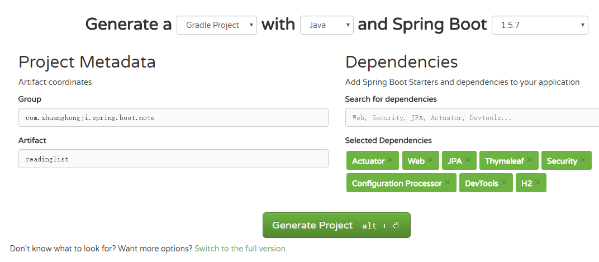

# 开发第一个应用程序
构建一个简单的阅读列表应用程序，用户可输入想读的图书信息、可查看图书列表、删除图书信息。

# 技术角度
* 用Spring MVC来处理Web请求
* 用Thymeleaf来定义Web视图
* 用Spring Data JPA来持久化阅读列表数据到数据库中（简单起见，使用嵌入式H2数据库）

# 创建项目
可通过  **官方Web页面** 创建项目，也可通过IDEA中的 **Spring Initializr** 进行创建。  
## 使用 [官方Web页面](https://start.spring.io/) 创建

右边可以搜索并选择你需要的依赖，如果不知道依赖关键字，可以点击图中下方的 **Switch to the full version** 直接根据依赖分类和依赖具体描述进行勾选。

## 创建成功后的代码大致结构  
  
程序代码目录 src/main/java    
程序资源目录 src/main/resources  
测试代码目录 src/test/java  
测试资源目录 src/testresources  
* build.gradle: Gradle构建说明文件
* ReadinglistApplication.java: 应用程序的启动引导类，也是主要配置类
* application.properties: 配置应用程序和Spring Boot的属性
* ReadinglistApplicationTest.java: 一个基本的集成测试类

### 构建说明文件
本实例直接选择了Gradle作为构建工具，对应生成了一个`build.gradle`文件（如果选择了Maven作为构建工具，则会生成一个`pom.xml`文件）。这两个文件都会描述项目的版本号、依赖，以及如何进行构建等信息。下面来看一下`build.gradle`这个文件：
```
buildscript {
    ext {
        springBootVersion = '1.5.7.RELEASE' // SpringBoot版本号
    }
    repositories {
        mavenCentral()
    }
    dependencies {
        // 依赖Spring Boot插件
        classpath("org.springframework.boot:spring-boot-gradle-plugin:${springBootVersion}")
    }
}

apply plugin: 'java'
apply plugin: 'eclipse'
apply plugin: 'org.springframework.boot' // 运用Spring Boot插件

version = '0.0.1-SNAPSHOT'
sourceCompatibility = 1.8

repositories {
    maven { url "http://repo.spring.io/milestone" }
    mavenCentral()
}

dependencies {
    // 起步依赖
    compile('org.springframework.boot:spring-boot-starter-actuator')
    compile('org.springframework.boot:spring-boot-starter-data-jpa')
    compile('org.springframework.boot:spring-boot-starter-security')
    compile('org.springframework.boot:spring-boot-starter-thymeleaf')
    compile("org.springframework.boot:spring-boot-configuration-processor")
    compile('org.springframework.boot:spring-boot-starter-web')
    runtime('org.springframework.boot:spring-boot-devtools')
    runtime('com.h2database:h2')
    testCompile('org.springframework.boot:spring-boot-starter-test')
    testCompile('org.springframework.security:spring-security-test')
}
```

### 启动引导类
启动引导类的两个作用：配置和启动引导。  
先来看下 `ReadingListApplication` 的代码：
```java
@SpringBootApplication
public class ReadingListApplication {
    public static void main(String[] args) {
        SpringApplication.run(ReadingListApplication.class, args);
    }
}
```
再来看下 `@SpringBootApplication` 注解的代码
```java
/**
 * Indicates a {@link Configuration configuration} class that declares one or more
 * {@link Bean @Bean} methods and also triggers {@link EnableAutoConfiguration
 * auto-configuration} and {@link ComponentScan component scanning}. This is a convenience
 * annotation that is equivalent to declaring {@code @Configuration},
 * {@code @EnableAutoConfiguration} and {@code @ComponentScan}.
 *
 * @author Phillip Webb
 * @author Stephane Nicoll
 * @since 1.2.0
 */
@Target(ElementType.TYPE)
@Retention(RetentionPolicy.RUNTIME)
@Documented
@Inherited
@SpringBootConfiguration
@EnableAutoConfiguration
@ComponentScan(excludeFilters = {
		@Filter(type = FilterType.CUSTOM, classes = TypeExcludeFilter.class),
		@Filter(type = FilterType.CUSTOM, classes = AutoConfigurationExcludeFilter.class) })
public @interface SpringBootApplication {
  // ...
}
```
* `@SpringBootConfiguration`: 标明该类使用Spring基于Java的配置
* `@EnableAutoConfiguration`: 启用Spring Boot的自动配置（使得我们不用再写成篇的配置代码）
* `@ComponentScan`: 启用组件扫描（使得Web控制器类和其他组件能被自动发现并注册为Spring应用程序上下文中的Bean）

运行Spring Boot应用程序可以打包成一个传统的WAR文件进行部署，也可以通过生成为一个可执行JAR文件来运行。通过命令行执行上面的 `main()` 方法可向 `SpringApplication.run()` 方法中传递 `ReadingListApplication` 类的引用和命令行参数，通过这些东西便可启动应用程序。


### 如何启动应用程序
* 最简单的方法是用Gradle的 **bootRun** 任务（来自Spring Boot的Gradle插件）：  
执行命令 `gradlew bootRun`  
* 也可以使用Gradle构建项目生成jar包，然后在命令行里用java来运行它：  
执行命令：`gradlew build` `java -jar build/libs/readinglist-0.0.1-SNAPSHOT.jar`  
（最终生成的jar包文件名可以在gradle.build文件中自定义）

应用程序正常运行之后，应用程序会启动一个监听8080端口的Tomcat服务器。  
使用浏览器访问 http://localhost:8080/ ：
* 书上说因为没写控制器类，会收到一个HTTP 404(NOT FOUND) 错误（未验证）
* 本项目将“阅读列表”功能监听端口设置为8888，访问8080时会打开Tomcat页面

### 测试应用程序
Initializr提供了一个测试类的骨架，可以基于它为我们的应用程序编写测试。
```java
@RunWith(SpringRunner.class)
@SpringBootTest
public class ReadinglistApplicationTests {

	@Test
	public void contextLoads() { // 测试加载的上下文
	}

}
```
// TODO 待补充

### 配置应用程序属性
Initializr自动生成的application.properties文件是一个空文件，用来指定应用程序代码所需的配置项。这个文件是可选的，可以删掉，但留着也没什么问题。  
前面讲到可以配置端口，如果我们在applicaption.properties配置文件里面添加这样一行代码：  
`server.port=8888`  
嵌入式Tomcat的监听端口就变成了8888，而不是默认的8080。需要注意的是，我们完全不用告诉Spring Boot去加载该文件，只要它存在就会被加载，Spring和应用程序都能获取其中的属性。

### Spring Boot项目的构建过程分析
Spring Boot为Gradle和Maven提供了构建插件，以辅助项目的构建。
* Gradle的构建脚本参考上面代码
* Maven的构建脚本是一个pom.xml文件（与Gradle类似，代码略）

构建插件的主要功能是把项目打包成一个可执行的超级JAR，包括把应用程序的所有依赖打入JAR文件内，并为JAR添加一个描述文件，其中的内容能让你用`java -jar`来运行应用程序。
