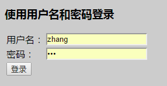
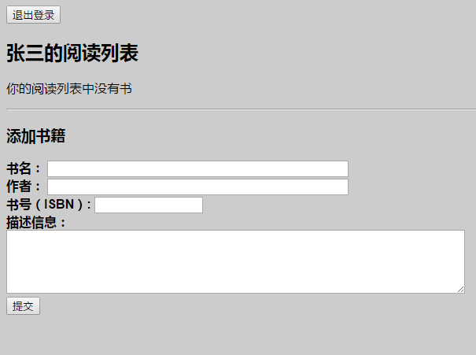
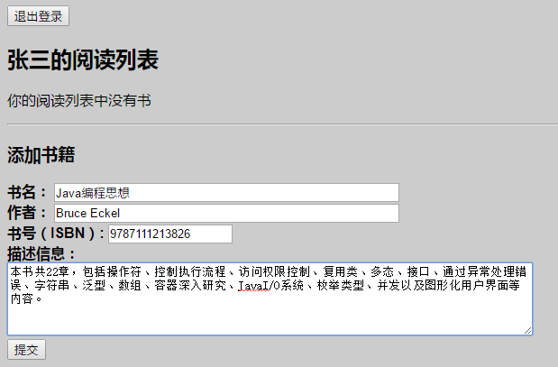
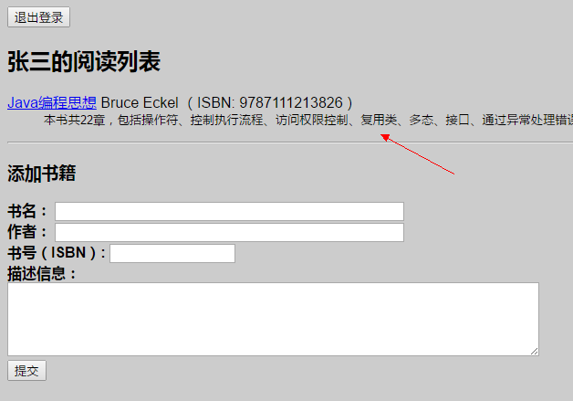
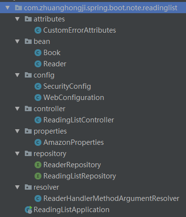
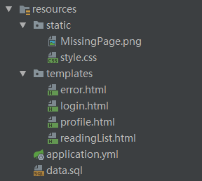

# “阅读列表”应用程序

## 效果图
### 登录页面


## 阅读列表页面
第一次登录，还未添加任何书籍  
```sql
-- 账号、密码、用户名称
insert into Reader (username, password, fullname) values ('zhang', 'san', '张三');
insert into Reader (username, password, fullname) values ('li', 'si', '李四');
```


添加《Java编程思想》这本书，然后点击“提交”按钮  


提交成功后会显示你提交的书籍，点击书名会跳转到亚马逊对应数据购买页面（模拟跳转，打开页面可能获取不到对应数据信息），添加书籍数量不受限制。  


## 代码结构
java代码  
  

资源代码  


## 具体代码
请查看该仓库的 samples/ReadingList 目录
