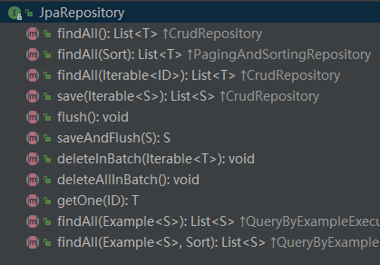
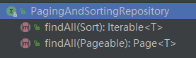
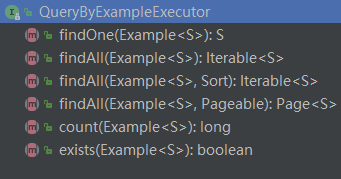
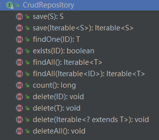
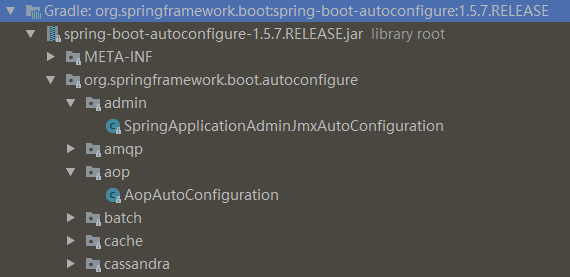

# 使用自动配置
Spring Boot的自动配置是一个运行时过程，运行时（应用启动时）决定“使用哪个”和“不使用哪个”Spring配置。  
比如说：
* **Spring的JdbcTemplate是不是在Classpath里面？**  
如果是并且有DataSource的Bean，则自动配置一个JdbcTemplate的Bean。
* **Thymeleaf是不是在Classpath里面？**  
如果是，则配置Thymeleaf的模板解析器、视图解析器、模板引擎。
* **Spring Security是不是在Classpath里面？**  
如果是，则进行一个非常基本的Web安全设置。

## 一、专注于应用程序功能
下面看看如何利用Spring Boot的自动配置，让我们专注于应用程序代码。

### 1. 定义领域模型
“阅读列表”应用程序的核心是书，所以需要定义一个实体类来表示这个概念。  
```java
@Entity
public class Book {
    // 注意，需要显示声明一个构造方法
    public Book() {}
    @Id
    @GeneratedValue(strategy = GenerationType.AUTO)
    private Long id;
    @ManyToOne
    private Reader reader;
    private String isbn;
    private String title;
    private String author;
    private String description;
    // ignore getter and setter
}
```
* `@Entity` 注解表示该类是一个JPA实体。
* `@Id` 和 `@GeneratedValue(strategy = GenerationType.AUTO)` 表示 `id` 这个字段是实体的唯一标识，并且这个字段的值是自动生成的。

### 2. 定义仓库接口
应用程序需要将 `Book` 对象持久化到数据库中，因为用到了Spring Data JPA，所以只需要简单定义一个接口：
```java
public interface ReadingListRepository extends JpaRepository<Book, Long>{
    // 根据读者来查找阅读列表
    List<Book> findByReader(Reader reader);
}
```
`JpaRepository` 是一个泛型接口，有两个参数：
* 仓库操作的领域对象类型
* 该领域对象ID属性的类型

在上述代码中，`ReadingListRepository` 从 `JpaRepository` 中继承的方法有：  
  

而 `JpaRepository` 从 `PagingAndSortingRepository` 和 `QueryByExampleExecutor` 中继承的方法有：  
  


而 `PagingAndSortingRepository` 从 `CrudRepository` 中继承的方法有：  


而 `CrudRepository` 继承自 `Repository`， `Repository`源代码（空接口）如下：  
```java
/**
 * Central repository marker interface. Captures the domain type to manage as well as the domain type's id type. General
 * purpose is to hold type information as well as being able to discover interfaces that extend this one during
 * classpath scanning for easy Spring bean creation.
 * <p>
 * Domain repositories extending this interface can selectively expose CRUD methods by simply declaring methods of the
 * same signature as those declared in {@link CrudRepository}.
 *
 * @see CrudRepository
 * @param <T> the domain type the repository manages
 * @param <ID> the type of the id of the entity the repository manages
 * @author Oliver Gierke
 */
public interface Repository<T, ID extends Serializable> {

}
```

### 3. 创建Web页面
定义Spring MVC控制器来处理应用程序的 HTTP 请求。
```java
@Controller
@RequestMapping("/")
@ConfigurationProperties("amazon")
public class ReadingListController {

    private ReadingListRepository mReadingListRepository;
    private AmazonProperties mAmazonProperties;

    @Autowired
    public ReadingListController(ReadingListRepository readingListRepository, AmazonProperties amazonProperties) {
        mReadingListRepository = readingListRepository;
        mAmazonProperties = amazonProperties;
    }

    /**
    * 处理 GET 请求，根据 Reader 从仓库中获取 Book 列表器。
    * 通过键 books 将这个列表塞入到模型中，最后返回 **readingList** 作为逻辑视图名
    */
    @RequestMapping(method = RequestMethod.GET)
    public String readerBooks(Reader reader, Model model) {
        List<Book> readingList = mReadingListRepository.findByReader(reader);
        if (readingList != null) {
            model.addAttribute("books", readingList);
            model.addAttribute("reader", reader);
            model.addAttribute("amazonID", mAmazonProperties.getAssociatedId());
        }
        return "readingList";
    }

    /**
    * 处理 POST 请求，将请求的数据绑定到一个Book对象上，
    * 再设置当前读者为该对象的 Reader，
    * 然后通过仓库的 save() 方法保存修改后的对象，
    * 最后再进行重定向。
    */
    @RequestMapping(method = RequestMethod.POST)
    public String addToReadingList(Reader reader, Book book) {
        book.setReader(reader);
        mReadingListRepository.save(book);
        return "redirect:/";
    }
}
```
* `@Controller` 注解使得组件扫描会自动将 ReadingListController 注册为Spring应用程序上下文里的一个Bean。
* `@RequestMapping("/")` 注解将其中所有的处理器方法（这里有两个）都映射到了"/"这个URL路径上。
 * `readerBooks()` 方法：在源代码src\main\resources\templates 目录下有一个 readingList.html 文件，便是用 Thymeleaf 为应用程序定义的视图，用于显示阅读列表和添加书籍等。
 * `addToReadingList()` 方法：重定向时发生的是 Get 请求，所以可以看做是添加书籍后再刷新列表页面。

### 4. 运行应用程序
运行具体效果看前文

### 5. 运行过程中发生了什么
配置是Spring Framewoek的核心，必须要有东西告诉Spring该如何运行程序。  

在向应用程序加入Spring Boot时，有个名为spring-boot-autoconfigure的JAR文件。在 External libraries中可以找到，如下图：  
  
其中包含了很多配置类，比如用于Thymeleaf的配置、用于Spring Data JPA的配置、用于Spiring MVC的配置等。  
每个配置类都在应用程序的Classpath里，我们可以自己选择是否在应用程序里使用它们。  

得益于Spring4.0引入的条件化配置 **允许配置存在于应用程序中，但在满足某些特定条件之前都是忽略这个配置**，我们可以很方便的编写自己的条件：实现 `Condition` 接口并覆盖它的 `matches()` 方法。    

举个例子：
```java
public class JdbcTemplateCondition implements Condition {
  @Override
  public boolean matches(ConditionContext context,
  AnnotatedTypeMetadata metadata) {
    try {
      context.getClassLoader().loadClass(
      "org.springframework.jdbc.core.JdbcTemplate");
      return true;
    } catch (Exception e) {
      return false;
    }
  }
}

// 当你用Java来声明Bean的时候，可以使用这个自定义条件类：
@Conditional(JdbcTemplateCondition.class)
public MyService myService() {
  ...
}
```
只有 `JdbcTemplateCondition` 类的条件成立时才会创建 `MyService` 这个Bean。也就是说，Classpath里有JdbcTemplate时才会创建，否则这个Bean的声明就会被忽略。  
Spring Boot定义了很多有趣的条件并运用到了配置类上，这些配置类构成了Spring Boot的自动配置。  

Spring Boot运用条件化配置的方法：  
**定义多个特殊的条件化注解，并将它们用在配置类上**

### 6. 自动配置中使用的条件化注解有：   

|条件化注解|配置生效条件|  
|--|--|
|@ConditionalOnMissingBean| 没有配置特定的Bean
|@ConditionalOnClass| Classpath里有指定的类
|@ConditionalOnMissingClass| Classpath里缺少指定的类
|@ConditionalOnExpression| 给定的Spring Expression Language（ SpEL）表达式计算结果为true
|@ConditionalOnJava| Java的版本匹配特定值或者一个范围值
|@ConditionalOnJndi| 参数中给定的JNDI位置必须存在一个，如果没有给参数，则要有JNDI InitialContext
|@ConditionalOnProperty| 指定的配置属性要有一个明确的值
|@ConditionalOnResource| Classpath里有指定的资源
|@ConditionalOnWebApplication| 这是一个Web应用程序
|@ConditionalOnNotWebApplication| 这不是一个Web应用程序

下面分析 `DataSourceAutoConfiguration` 这个类，简单了解下Spring Bootd的自动配置库。  
（一般来说我们是无需查看Spring Boot自动配置类的源代码的）
```java
@Configuration
@ConditionalOnClass({ DataSource.class, EmbeddedDatabaseType.class })
@EnableConfigurationProperties(DataSourceProperties.class)
@Import({ Registrar.class, DataSourcePoolMetadataProvidersConfiguration.class })
public class DataSourceAutoConfiguration {
    // ...
    @Configuration
    @ConditionalOnProperty(prefix = "spring.datasource", name = "jmx-enabled")
    @ConditionalOnClass(name = "org.apache.tomcat.jdbc.pool.DataSourceProxy")
    @Conditional(DataSourceAutoConfiguration.DataSourceAvailableCondition.class)
    @ConditionalOnMissingBean(name = "dataSourceMBean")
    protected static class TomcatDataSourceJmxConfiguration {
      @Bean
      public Object dataSourceMBean(DataSource dataSource) {
        if (dataSource instanceof DataSourceProxy) {
          try {
            return ((DataSourceProxy) dataSource).createPool().getJmxPool();
          }
          catch (SQLException ex) {
            logger.warn("Cannot expose DataSource to JMX (could not connect)");
          }
        }
        return null;
      }
    }
    // ...
}
```
* `@ConditionalOnClass`注解：要求Classpath里必须要有 `DataSource`和  `EmbeddedDatabaseType`。如果这两者不存在，条件就不成立，`DataSourceAutoConfiguration` 提供的配置都会被忽略掉。

```java
// @since 1.4.0
@Configuration
@ConditionalOnClass({ DataSource.class, JdbcTemplate.class })
@ConditionalOnSingleCandidate(DataSource.class)
@AutoConfigureAfter(DataSourceAutoConfiguration.class)
public class JdbcTemplateAutoConfiguration {
	private final DataSource dataSource;
	public JdbcTemplateAutoConfiguration(DataSource dataSource) {
		this.dataSource = dataSource;
	}

	@Bean
	@Primary
	@ConditionalOnMissingBean(JdbcOperations.class)
	public JdbcTemplate jdbcTemplate() {
		return new JdbcTemplate(this.dataSource);
	}

	// ...
}

public interface JdbcOperations {
  // ...
}

public class JdbcTemplate extends JdbcAccessor implements JdbcOperations {
  // ...
}
```
* `@ConditionalOnClass`注解：要求Classpath里必须要有 `DataSource` 和 `JdbcTemplate`。如果这两者不存在，条件就不成立，`JdbcTemplateAutoConfiguration` 提供的配置都会被忽略掉。
* `@Bean`注解：使得 `jdbcTemplate()` 方法会配置一个 JdbcTemplate Bean。
* `@ConditionalOnMissingBean`注解：说明只有不存在 `JdbcOperations`（`JdbcTemplate` 实现的接口）类型的Bean时，才会创建 `JdbcTemplate` Bean。

### 7. “阅读列表”应用程序中的配置决策
* Classpath里有H2，所以会创建一个嵌入式的H2数据库Bean。  
它的类型是 `javax.sql.DataSource`，JPA实现（Hibernate）需要它来访问数据库。

* Classpath里有Hibernate（由Spring Data JPA传递引入）的实体管理器，所以会自动配置与Hibernate相关的Bean。  
包括 Spring 的 `LocalContainerEntityManagerFactoryBean` 和 `JpaVendorAdapter`。

* Classpath里有Spring Data JPA，所以它会自动配置为根据仓库的接口创建仓库实现。

* Classpath里有Thymeleaf，所以Thymeleaf会配置为Spring MVC的视图。  
包括一个
Thymeleaf的模板解析器、模板引擎及视图解析器。  
***视图解析器会解析相对于Classpath根
目录的/templates目录里的模板。***

* Classpath 里 有 Spring MVC （ 归 功 于 Web 起 步 依 赖 ）， 所 以 会 配 置 Spring 的 `DispatcherServlet` 并启用Spring MVC。

* Classpath里有Tomcat（通过Web起步依赖传递引用），所以会启动一个嵌入式的Tomcat
容器。  
默认监听的是8080端口。

* 这是一个Spring MVC Web应用程序，所以会注册一个资源处理器。  
资源处理器会把相对于Classpath
根目录的 **/static** 目录里的静态内容提供出来。  
这个资源处理器还能处理 **/public**、 **/resources** 和 **/META-INF/resources** 的静态内容。

### 8. 小结
Spring Boot自动配置承担了配置Spring的重任，所以我们可以专注于编写自己的应用程序。  
但有时在开发应用时，我们希望或者需要不一些同的配置，那该怎么办？  
**通过自定义配置来进行覆盖自动配置，见下一篇内容**
