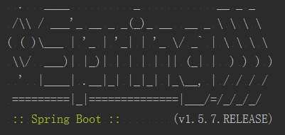
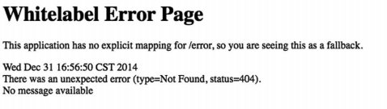
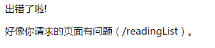

# 自定义配置
* 两种影响自动配置的方式
 * 使用显式配置进行覆盖
 * 使用属性进行精细化配置
* 使用Spring Boot提供的钩子引人自定义错误页

## 一、覆盖Spring Boot的自动配置
如果不用配置就能得到和显式配置一样的结果，那么不写配置是直接选择。  
但有些情况自动配置并不能进行很好的推断，这时就需要进行覆盖。  

举个例子：当你在应用程序中添加安全特性时，应用程序安全有很多决策要做，Spring Boot虽然为安全提供了一定的自动配置，但我们还是需要自己覆盖一些配置以满足特定的安全需求。  

在“阅读列表”应用程序中我们在 build.gradle 文件中加了下面这个起步依赖：
```gradle
compile('org.springframework.boot:spring-boot-starter-security')
```
添加依赖之后运行即可，但是默认的安全配置并不复合理想，所以我们需要创建自定义的安全配置去覆盖自动配置。  
思想上很简单， **就当自动配置不存在，直接显式地写一段配置**。  

### 1. 创建自定义的安全配置
在编写显式配置时，我们会专注于Java形式的配置。  
在Spring Boot场景下，这意味着要写一个扩展了 `WebSecurityConfigurerAdapter` 的配置类。  
代码如下：
```java
@Configuration
public class SecurityConfig extends WebSecurityConfigurerAdapter {
    private final ReaderRepository mReaderRepository;
    @Autowired
    public SecurityConfig(ReaderRepository mReaderRepository) {
        this.mReaderRepository = mReaderRepository;
    }

    @Override
    protected void configure(HttpSecurity http) throws Exception {
        http.authorizeRequests()
                // 要求登录者有 ROLE_READER 角色
                .antMatchers("/").access("hasRole('ROLE_READER')")
                .antMatchers("/**").permitAll()
                .and()
                .formLogin()
                // 设置登录表单的路径
                .loginPage("/login")
                .failureUrl("/login?error=true");
    }

    @Override
    protected void configure(AuthenticationManagerBuilder auth) throws Exception {
        // 定义自定义 UserDetailsService
        // 这个服务可以是任意实现了 UserDetailsService 的类，用于查找
        // 指定用户名的用户
        auth.userDetailsService(userDetailsService());
    }

    @Bean
    @Override
    protected UserDetailsService userDetailsService() {
        return new UserDetailsService() {
            // 注意：我们之前定义的 Reader 实现了 UserDetails 接口
            @Override
            public UserDetails loadUserByUsername(String username) throws UsernameNotFoundException {
                UserDetails userDetails = mReaderRepository.findOne(username);
                if (userDetails != null) {
                    return userDetails;
                }
                throw new UsernameNotFoundException("User '" + username + "' not found");
            }
        };
    }
}
```
我们自定义的 `SecurityConfig` 是个非常基础的Spring Security配置，但它还是完成了不少安全定制工作，并且使得Spring Boot跳过了安全自动配置，转而使用我们自定义的安全配置。  

在上面代码中，我们覆盖了两个 `configure()` 方法，这里分析第一个：
* 指明了“/”路径的请求只有经过身份认证且拥有 **ROLE_READER** 角色的用户才能访问。
* 其他的所有请求路径向所有用户开放了访问权限。
* 登录页和登录失败页（带有一个 `error` 属性）指定到了 `/login` 。

> Spring Security 为身份认证提供了众多选项，后端可以使JDBC、LDAP和内存用户存储。

在这个应用程序中，我们会通过JPA来存储用户信息。

### 2. 持久化读者信息
#### 实体类
前文已经提到了 `Reader` JPA实体类，有几个字段分别用来存储用户名、用户名称和密码。  
这里再补充说明下，`Reader` 实现了 `UserDetails` 接口以及其中的方法，这样 Reader 字段就能代表 Spring Security 里的用户了。  

> 在一个大型应用程序里，赋予用户的授权本身也可能是实体，他们被维护在独立的数据表里。同样，表示一个账户是否为非过期、非锁定且可用的布尔值也是数据库里的字段。

重申一下，要想覆盖自动配置，需要做的仅仅是编写一个显式的配置。Spring Boot会发现你的配置并降低自动配置的优先级，以你的配置为准。

#### 仓库接口
```java
public interface ReaderRepository extends JpaRepository<Reader, String> {
    // nothing
}
```
和前文提到的 `BookRepository` 类似，我们无需自己实现 `ReaderRepository` 。因为继承自 `JpaRepository`，Spring Data JPA 在运行时会自动创建它的实现。

### 3. 分析自动配置是如何实现的
#### JdbcTemplate
先来看一段代码（节选自 `JdbcTemplateAutoConfiguration` 类）
```java
@Bean
@Primary
@ConditionalOnMissingBean(JdbcOperations.class)
public JdbcTemplate jdbcTemplate() {
  return new JdbcTemplate(this.dataSource);
}
```
`jdbcTemplate()` 方法使用该注解，要求当前不存在 `JdbcOperations` 类型的Bean时才生效，如果当前已经存在一个该类型的Bean，那么该条件不满足，则不会执行该方法。  

> 大部分情况下，`@ConditionalOnMissingBean` 注解是覆盖自动配置的关键。  
> Spring Boot的设计是“记载应用级配置，然后再考虑加载自动配置类”。  

#### Spring Security
Spring Security的自动配置会考虑几个配置类，在覆盖自动配置的安全配置时，最重要的一个类是 `SpringBootWebSecurityConfiguration`，看一下它的代码片段：
```java
@Configuration
@EnableConfigurationProperties
@ConditionalOnClass({ EnableWebSecurity.class, AuthenticationEntryPoint.class })
@ConditionalOnMissingBean(WebSecurityConfiguration.class)
@ConditionalOnWebApplication
@EnableWebSecurity
public class SpringBootWebSecurityConfiguration {
  // ...
}
```
* `@ConditionalOnWebApplication` 注解：说明这必须是个Web应用程序。
* `@ConditionalOnClass` 注解：说明Classpath里需要有 `EnableWebSecurity` 注解和 `AuthenticationEntryPoint` 接口的实现类。  
* `@ConditionalOnMissingBean` 注解：要求当下没有 `WebSecurityConfiguration` 类型的Bean，**这才是我们的安全配置类代替 SpringBootWebSecurityConfiguration 的关键所在**。

```java
@Retention(value = java.lang.annotation.RetentionPolicy.RUNTIME)
@Target(value = { java.lang.annotation.ElementType.TYPE })
@Documented
@Import({ WebSecurityConfiguration.class,
		SpringWebMvcImportSelector.class })
@EnableGlobalAuthentication
@Configuration
public @interface EnableWebSecurity {

	/**
	 * Controls debugging support for Spring Security. Default is false.
	 * @return if true, enables debug support with Spring Security
	 */
	boolean debug() default false;
}
```
表面上，我们并没有创建 `WebSecurityConfiguration` 的Bean。实际上，`@EnableWebSecurity` 注解间接地创建了一个。也就是说，在自动配置时，这个Bean已经存在了，`@ConditionalOnMissingBean` 的条件不成立，故 `SpringBootWebSecurityConfiguration` 提供的配置就被跳过了。

## 二、通过属性文件外置配置
有时我们需要微调配置中的一些细节，比如修改端口、修改日志级别或重新设置数据库的URL。此时我们是不需要覆盖自动配置的，配置一个属性显得更加简单。  
Spring 提供了300多个用于微调的属性，调整途径有：
* 环境变量
* Java系统属性
* JNDI (Java Naming and Directory Interface)
* 命令行参数
* 属性文件

下面通过一个简单的例子来了解下这些属性。在启动Spring Boot应用程序是，我们会在命令行中看到这样一个 `Banner` :  
  
如果想禁用它，需要将spring.main.show-banner属性置为false，简单介绍下常用的几种方式：  
* 在命令行参数中指定
`$ java -jar readinglist-0.0.1-SNAPSHOT.jar --spring.main.show-banner=false`
* 创建一个名为application.properties的文件，包含内容
`spring.main.show-banner=false`
* 或者创建一个名为application.yml的文件，包含内容
```
spring:
  main:
    show-banner: false
```

更多属性可参考我前面总结的[通用属性列表](https://github.com/zhuanghongji/spring-boot-note/blob/master/note/0-common-application-properties.md)。  

## 三、定制程序错误页面
Spring Boot提供了默认的错误页，大致如下图：  

  

Spring Boot自动配置的默认错误处理器会查找名为 **error** 的视图，找不到就会使用默认的。因此，我们可以创建一个自定义视图，让解析出的视图名为 error，这一点取决于错误视图解析时的视图解析器。  
* 实现了Spring的View接口的Bean，其ID为error（由Spring的BeanNameViewResolver所解析）
* 如果配置了Thymeleaf，则有名为error.html的Thymeleaf模板
* 如果配置了FreeMarker，则有名为error.ftl的FreeMarker模板
* 如果配置了Velocity，则有名为error.vm的Velocity模板
* 如果是用JSP视图，则有名为error.jsp的JSP模板


在“阅读列表”应用程序中，我们使用了Thymeleaf，所以需要创建一个名为error.html的文件，把它和其他的应用程序模板一起放在模板文件夹里面。效果图和代码如下：  
  
```html
<!DOCTYPE html>
<html lang="en" xmlns:th="http://www.w3.org/1999/xhtml">
<head>
    <meta charset="UTF-8"/>
    <title>噢，出错了</title>
    <link rel="stylesheet" th:href="@{/style.css}"/>
</head>
<body>
    <div class="errorPage">
        <span class="oops">出错了啦!</span>
        
        <p>好像你请求的页面有问题（<span text="${path}"></span>）。</p>
        <p th:text="${'详情：' + message}"></p>
    </div>
</body>
</html>
```
其中有两处特别的信息需要呈现：错误的请求路径和异常消息，但这并非错误页上的全部细节。默认情况下，Spring Boot会为错误视图提供如下错误属性 ：  
* timestamp：错误发生的时间
* status：HTTP状态码
* error：错误原因
* exception：异常的类名
* message：异常消息（如果这个错误是由异常引起的）
* errors：BindingResult异常里的各种错误（如果这个错误是由异常引起的）
* trace：异常跟踪信息（如果这个错误是由异常引起的）
* path：错误发生时请求的URL路径
