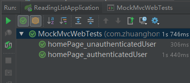

# 关于测试
前面我们差不多用Spring Boot写了一个相对完整应用程序，我们会验证它是否能满足预期。除了在浏览器中手动点击验证外，我们还需要写一些自动化、可重复运行的测试来进行检查。  

Spring鼓励松耦合、接口驱动的设计，这些使得编写单元测试更加轻松。  
在编写单元测试时，Spring通不需要介入。但是，在继承测试中需要用到Spring。如果生产应用程序使用Spring来配置并组装组件，那么测试就需要用它来配置并组装那些组件。

Spring的 `SpringJUnit4ClassRunner` 可以在基于 `JUnit` 的应用程序测试里加载Spring应用程序上下文。在测试Spring Boot应用程序时，**Spring Boot除了拥有Spring的集成测试支持，还开启了自动配置和Web服务器，并提供了不少实用的测试辅助工具**。

## 一、集成测试自动配置
对Spring应用程序进行集成测试时，让Spring遵照生产环境来组装测试目标Bean是非常重要的一点。当然，你也可以手动初始化并将它们注入其他组件，但对大型应用来说是件费力不讨好的事情。  

自Spring 2.5开始，集成测试支持的形式就变成了 `SpringJUnit4ClassRunner`。这是一个JUnit类运行器，会为JUnit测试加载Spring应用程序上下文，并为测试类自动织入所需的Bean。  

看一个代码片段：
```java
// 开启Spring集成测试支持
@RunWith(SpringJUnit4ClassRunner.class)
// 加载应用程序上下文
@ContextConfiguration(classes=AddressBookConfiguration.class)
public class AddressServiceTests {
  // 注入地址服务
  @Autowired
  private AddressService addressService;

  // 测试服务地址
  @Test
  public void testService() {
    Address address = addressService.findByLastName("Sheman");
    assertEquals("P", address.getFirstName());
    assertEquals("Sherman", address.getLastName());
    assertEquals("42 Wallaby Way", address.getAddressLine1());
    assertEquals("Sydney", address.getCity());
    assertEquals("New South Wales", address.getState());
    assertEquals("2000", address.getPostCode());
  }
}
```
* 除了加载应用程序上下文，SpringJUnit4ClassRunner还能通过自动织入从应用程序上下文里向测试本身注入Bean。因为这是一个针对 `AddressService` Bean的测试，所以需要将它注入测试。最后，`testService()` 方法调用地址服务并验证了结果。
* @ContextConfiguration在加载Spring应用程序上下文的过程中做了很多事情，但它没能加载完整的Spring Boot。 Spring Boot应用程序最终是由SpringApplication加载的。

SpringApplication不仅加载应用程序上下文，还会开启日志、加载外部属性（application.properties或application.yml）以及其他Spring Boot特性。用@ContextConfiguration则得不到这些特性，要在集成测试中得到，可以把 `@ContextConfiguration` 替换为Spring Boot的 `@SpringApplicationConfiguration` :  
```java
@RunWith(SpringJUnit4ClassRunner.class)
@SpringApplicationConfiguration(classes=AddressBookConfiguration.class)
public class AddressServiceTests {
  // ...
}
```
两者用法大致相同，但也有不同的地方。  
>我们有充分的理由说，在大多数情况下，为Spring Boot应用程序编写测试时应该用 `@SpringApplicationConfiguration` 代替 `@ContextConfiguration`

## 二、测试Web应用程序
针对控制器编写测试，就像测试POJO一样。  
举个例子：
```java
@Controller
@RequestMapping("/")
@ConfigurationProperties("amazon")
public class ReadingListController {
    private ReadingListRepository mReadingListRepository;

    // ...

    @RequestMapping(method = RequestMethod.POST)
    public String addToReadingList(Reader reader, Book book) {
        book.setReader(reader);
        mReadingListRepository.save(book);
        return "redirect:/";
    }
}
```
如果忽略 `addToReadingList()` 方法的注解，这就是个简单的Java方法。  
但是不能简单的通过提供一个 `ReadingListRepository` 的模拟实现，然后调用 `addToReadingList()` 方法，再判断返回值并验证 `mReadingListRepository.save()` 方法是否有过调用这样子进行测试。因为我们 **不仅仅要测试方法本身，还要测试该方法处理POST请求的情况和测试表单域绑定到Book参数的情况**。  

要恰当的测试一个Web应用程序，需要投入一些实际的HTTP请求，确认它能正确地处理这些请求。  
在Spring Boot中，有两个可选的方案能实现这类测试：
* Spring Mock MVC：在一个近似真实的模拟Servlet容器中测试控制器，而不用实际启动应用服务器。
* Web集成测试：在嵌入式Servlet容器中启动应用程序，在真正的应用服务器中执行测试。

### 1.模拟Spring MVC
要在测试里设置Mock MVC，可以使用 `MockMvcBuilders` 类。  
该类提供了两个静态方法：
```java
public class MockMvcBuilders {

  // 使用Spring应用程序上下文来构建Mock MVC，该上下文里可以包含一个或多个配置好的控制器
  // 两者区别：基于一个WebApplicationContext实例，通常由Spring加载控制器和依赖，以
  // 便进行完整的集成测试。
	public static DefaultMockMvcBuilder webAppContextSetup(WebApplicationContext context) {
		return new DefaultMockMvcBuilder(context);
	}

	/**
	 * 构建一个 Mock MVC，提供一个或多个手工创建并配置的控制器配置好的控制器
   * 两者区别：希望你手工初始化并注入你要测试的控制器，同单元测试更加接近，你可能只
   * 想让它专注于单一控制器的测试。
	 * @param controllers one or more {@code @Controller} instances to test
	 */
	public static StandaloneMockMvcBuilder standaloneSetup(Object... controllers) {
		return new StandaloneMockMvcBuilder(controllers);
	}
}
```
“阅读列表”中用的是 `webAppContextSetup()`，Spring完成了 `ReadingListController` 的初始化，并从Spring Boot自动配置的应用程序上下文中将其注入，我们可以直接对其进行测试。  
```java
@RunWith(SpringJUnit4ClassRunner.class)
@ContextConfiguration(classes = ReadingListApplication.class)
@WebAppConfiguration                 // 开启Web上下文测试
public class MockMvcWebTests {

    @Autowired                      // 注入 WebApplicationContext
    private WebApplicationContext mWebApplicationContext;

    private MockMvc mMockMvc;

    @Before
    public void setupMockMvc() {    // 设置MockMvc
        mMockMvc = MockMvcBuilders
                .webAppContextSetup(mWebApplicationContext)
                .apply(springSecurity())
                .build();
    }

    // ...
}
```
* `webAppContextSetup()` 方法接受一个 WebApplicationContext 参数，所以我们需要为测试类加上 `@WebAppConfiguration` 注解。
* 然后使用 `@Autowired` 注解将 WebApplicationContext 作为实例变量注入测试类。
* `@Before` 注解表明该方法应该在测试方法之前执行。
* `springSecurity()` 方法返回了一个Spring MVC配置器，为Mock MVC开启了Spring Security支持。这样，Spring Security会介入MockMvc上执行的每个请求。

现在我们有了一个MockMvc，已经可以开始写测试方法了。

### 2.测试Web安全
```java
    // 在请求主页的时候，如果未经身份验证，我们应该期待重定向到登录页面
    @Test
    public void homePage_unauthenticatedUser() throws Exception {
        mMockMvc.perform(get("/"))
                .andExpect(status().is3xxRedirection())
                .andExpect(header().string("Location", "http://localhost/login"));
    }

    @Test
    // 根据给定的用户名查找 UserDetail 对象，加载安全上下文
    @WithUserDetails("li")
    // 记载安全上下文，其中包含一个 UserDetails，使用了给定的用户名、密码和授权
    @WithMockUser(username = "li", password = "si", roles = "ROLE_READER")
    public void homePage_authenticatedUser() throws Exception {
        // 配置期望的Reader
        Reader expectedReader = new Reader();
        expectedReader.setUsername("li");
        expectedReader.setPassword("si");
        expectedReader.setFullname("李四");
        // 发起GET请求
        mMockMvc.perform(get("/"))
                .andExpect(status().isOk())
                .andExpect(view().name("readingList"))
                .andExpect(model().attribute("reader", samePropertyValuesAs(expectedReader)))
                .andExpect(model().attribute("books", hasSize(0)))
                .andExpect(model().attribute("amazonID", "zhuang"));
    }
```
测试成功页面：  

## 三、测试运行中的应用程序
### 1.用随机端口启动服务器
// TODO
### 2.使用Selenium测试HTML页面
// TODO
